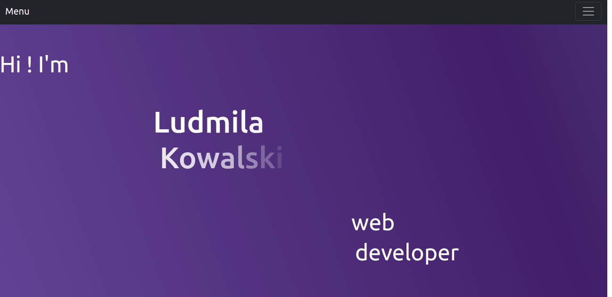
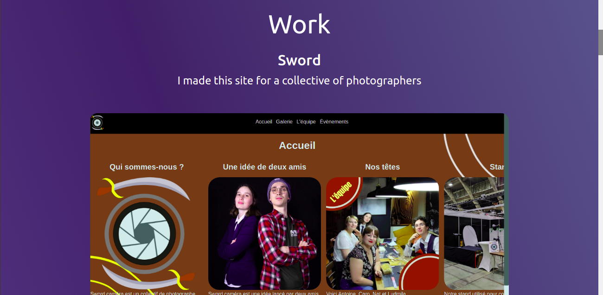

# Portfolio

## Instructions

I created a website for introduce my work. You can see vaious exemple of my work.

## Techno

I used html and css for the design and Bootraps for the navbar.

## Result

You can see here some exemple :

## Link

https://ludmilakowalski.github.io/Portfolio/